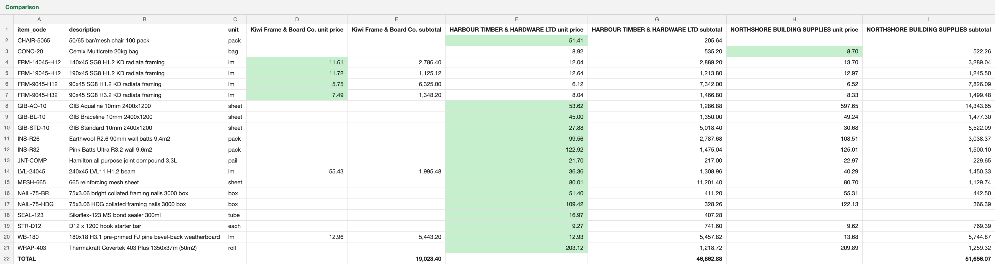
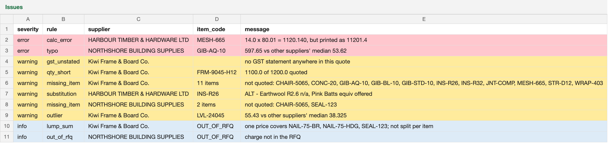

# Quote Cleaner

Turns messy supplier quotes (an Excel sheet, a PDF and a plain-text email, each in its own format) into
**one comparable price table plus a list of problems a human should look at**.

Built as a demo for a building-supplies use case: a design-and-build company sends one RFQ (20 items) to
several merchants and gets back quotes that differ in format, units, GST treatment and wording.

> All data is mock data. Suppliers, names and quote numbers are fictional; prices are based on public
> Bunnings NZ retail prices (2026-09-26) with simulated trade discounts.



## The core idea

**The AI only reads and understands. Rules and maths live in code. Anything uncertain goes to a human.**

| Step | Done by | Why |
|---|---|---|
| Read `.xlsx` / `.pdf` / `.txt` into numbered lines | Code (`openpyxl`, `pdfplumber`) | Deterministic and testable |
| Pull out quote lines and match them to RFQ item codes | **LLM** (OpenAI structured outputs + Pydantic schema) | Free-text product names ("GIB AQ 10 2.4", "4x2 H1.2") need understanding |
| Check every number the AI returns is really printed in the source line; retry once, then flag for a human | Code | Stops invented numbers, and stops the model quietly "fixing" a supplier's typo |
| Unit conversion (length → lm, m² → sheet) and GST (÷ 1.15) | Code, `Decimal` maths | An LLM that is right 99% of the time is the hardest kind of wrong to catch |
| Detect issues (11 rules, thresholds in `config.py`) | Code | Explainable, adjustable by a non-developer |
| Store raw and normalised lines separately (SQLite, upserts) | Code | Every number traces back to its source line; re-running is safe |
| Export comparison + issues to Excel | Code | Cheapest supplier per item highlighted, issues colour-coded by severity |

The model can only choose an item code from the RFQ's 20 codes or `OUT_OF_RFQ` (enforced by the schema
*and* re-checked in code). Only `src/extract.py` talks to the LLM.

## Results

Measured by `src/evaluate.py` against a hand-written answer key (`data/answer_key/expected_normalised.csv`)
for the three supported files (A: Excel, B: PDF, C: email). The model's output varies from run to run, so this
shows the range over the last three runs (with `gpt-4o-mini`), not just the best one:

| Metric | Target | Result |
|---|---|---|
| Item-match accuracy (before human review) | ≥ 95% | **96.5–100%** |
| Unit price within $0.01, quantity within 0.01 | 0 misses | **0** |
| ERROR-level issues found (calc error, price typo) | 100% | **100%** (2/2) |
| WARNING-level issues found | 100% | **100%** (17/17) |
| False ERRORs | 0 | **0** |
| False WARNINGs | keep low | **0–6** (when a match or a bundle is missed) |
| End-to-end run (3 files) | < 2 min | under 1 min |

What it catches in the mock data, among others: a line total with an extra zero (11,201.40 instead of
1,120.14), a unit price ×10 (687.30 for plasterboard that costs ~$60), an LVL beam priced 45% above the other
suppliers, a quote with no GST statement, a short-supplied quantity and an unannounced product substitution.



**Honest notes from tuning** (the full story is in the commit history):

- LLM output varies between runs. Validation failures retry once and are then **flagged for a human
  instead of guessed at**, so a bad run shows up as "needs review", not as wrong numbers.
- Several problems looked like prompt problems but were fixed in code. Example: a PDF's text layer puts
  `TOTAL (incl GST)` and `$59,589.49` on separate lines, so the grounding check now also accepts the value
  on the line directly below its label.
- The issues list is written for a person, not for the scorer. `rules.py` reports one finding per item (that's
  what gets scored), but the Excel groups a supplier's missing items into one row: "doesn't sell plasterboard"
  is one fact, not 11 things to act on.
- Understanding vs rules, again: for a bundled price ("nails and Sikaflex, $980 all up") the AI says *which*
  RFQ items the bundle covers (stored in its own table, foreign-keyed to the RFQ), and code decides those
  items are therefore not missing.
- Some prompt changes made things worse: one fixed a false positive on one file but broke extraction on
  another, so it was reverted.

## Run it

Requires Python 3.12 and an OpenAI API key.

```bash
python -m venv .venv && source .venv/bin/activate
pip install -r requirements.txt
cp .env.example .env          # then set OPENAI_API_KEY and QUOTE_MODEL (e.g. gpt-4o-mini)

python -m src.pipeline --check   # verify input files and settings
python -m src.pipeline --run     # extract → normalise → store → detect issues → output/comparison.xlsx
python -m src.evaluate           # score the run against the answer key
pytest                           # 110 offline unit tests, no API calls
```

Debug one file: `python -m src.pipeline --read FILE` (what the reader sees) or `--extract FILE` (what the AI returns).

## Project layout

```text
src/
  readers.py    read xlsx / pdf / txt into numbered source lines
  schemas.py    Pydantic models; item_code limited to the RFQ's codes + OUT_OF_RFQ
  extract.py    the only LLM call: structured extraction + matching, retry once
  validate.py   grounding checks: every number must appear in its source line
  normalise.py  unit + GST conversion (pure functions, Decimal)
  db.py         SQLite schema, idempotent upserts, raw vs normalised tables
  rules.py      11 issue-detection rules (pure functions)
  export.py     comparison + issues workbook (openpyxl)
  evaluate.py   accuracy report against the answer key
  pipeline.py   CLI that wires the stages together
  config.py     every threshold, path and model setting in one place
tests/          unit tests for every pure module
data/           mock RFQ, reference prices, supplier quotes, answer key
```

## Roadmap

- Image quotes via a vision model: a Chinese WeChat screenshot and an English SMS screenshot (both
  always routed to human review)
- Human review queue: low-confidence matches, substitutions and image rows wait for confirmation
- Web UI: FastAPI backend + React/TypeScript frontend (upload → compare → confirm → download)
- Cost per run from the logged token counts
